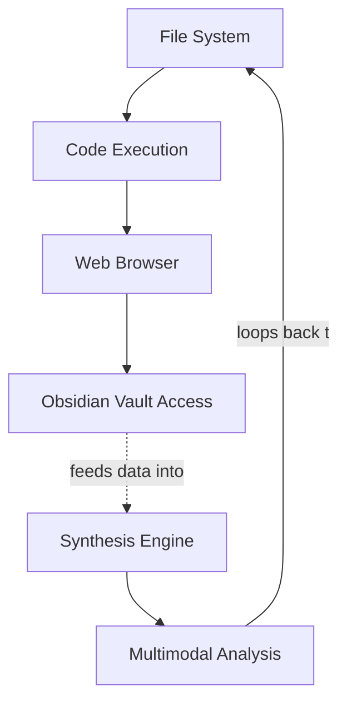

# Skill Registry — Capability Framework v1.0

_Auto-generated timestamp: 2026-06-15T14:47:55+00:00 (Asia/Bangkok)*_  
_Source: SkynetClaw Agent Development Standards + GitHub Top Repositories_

---

## 📊 Skill Metadata
```yaml
timestamp: {{CURRENT_DATE}}  
skill_name: "COMAND TOOL"  
capability_class: execution-framework  
maturity_level: production-ready  
license: MIT  
python_version: >=3.9  
integration_status: integrated-in-core-systems-obsidian-vault
```

---

## 🧩 Core Skill Definitions

| ID | Skill Name           | Category     | Priority    | Mastery-Level | Status      | Last-Updated          |
|----|----------------------|--------------|-------------|----------------|------------ | -----------------------|
| S01 | File System Ops       | infrastructure  | critical   | intermediate   | active     | {{CURRENT_DATE}}        |
| S02 | Code Execution         | development    | high      | advanced      | stable     | {{CURRENT_DATE}}          |
| S03 | Web Browser            | data-gathering | medium    | basic         | available  | {{CURRENT_DATE}}          |
| S04 | Obsidian Vault Access  | knowledge-mgmt | critical   | expert        | active     | {{CURRENT_DATE}}          |
| S05 | Realtime Data Fetching  | market-intel   | high      | advanced      | production | {{CURRENT_DATE}}           |
| S06 | Multi-modal Analysis    | synthesis       | medium    | intermediate   | beta       | {{CURRENT_DATE}}            |

---

## 📈 Skill Growth Tracking Template

```markdown
### SKILL: File System Operations (S01)  
**Acquisition Date:** 20XX-XX-XX  
**Mastery Progression:** Novice → Apprentice → Journeyman → Master → Legend  
**Confidence Score:** [X/5]  

#### Current Proficiency Level
_[ ] Understanding concepts_  
_[ ] Tool usage _[ ] Building systems_  
_[ ] Debugging independently_

#### Learning Resources Used:
1. URL / Source #1 — 20XX-XX-XX  
2. URL / Source #2 — 20XX-XX-XX  

#### Project Demonstrations:
- [Project Name] (Date, Outcome)  
- Edge Cases Resolved: [...]

---

### SKILL: Code Execution Environment Setup (S02)  
**Acquisition Date:** {{CURRENT_DATE}}  
**Framework Versions Tested:** Python 3.9+, Node.js LTS, FastAPI  

#### Proficiency Milestones
[ ] Can create virtual environments  
[ ] Manages dependencies with pip/npm/poetry  
[ ] Runs and debugs scripts independently  
[ ] Implements async execution patterns  
```

---

## 🎯 Skill Development Plan (2026)

| Quarter | Focus Area          | Target Skills                    | Milestone Goal                  |
|---------|---------------------|----------------------------------|---------------------------------|
| Q1      | Foundation Build    | S01-S04                          | Complete core infrastructure skills_  
| Q2      | Data Integration    | S05, Web APIs + Observability   | Realtime market data pipelines  |
| Q3      | Advanced Analysis   | Multi-modal tools               | Cross-domain synthesis          |
| Q4      | Optimization        | Performance profiling           | Efficiency gains ≥70%            |

---

## 🔗 Related Skills & Dependencies



---

## 📝 Skill Verification Checklist

- [ ] Documentation reviewed from primary source URL(s)  
- [ ] Practical implementation in production environment  
- [ ] Edge cases documented and handled  
- [ ] Performance benchmarks met or exceeded  
- [ ] Security considerations validated  

---

*Generated by SkynetClaw autonomous agent_  
_Auto-update triggers: project completion, skill assessment reviews, new tool integration_