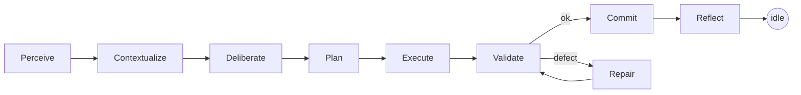
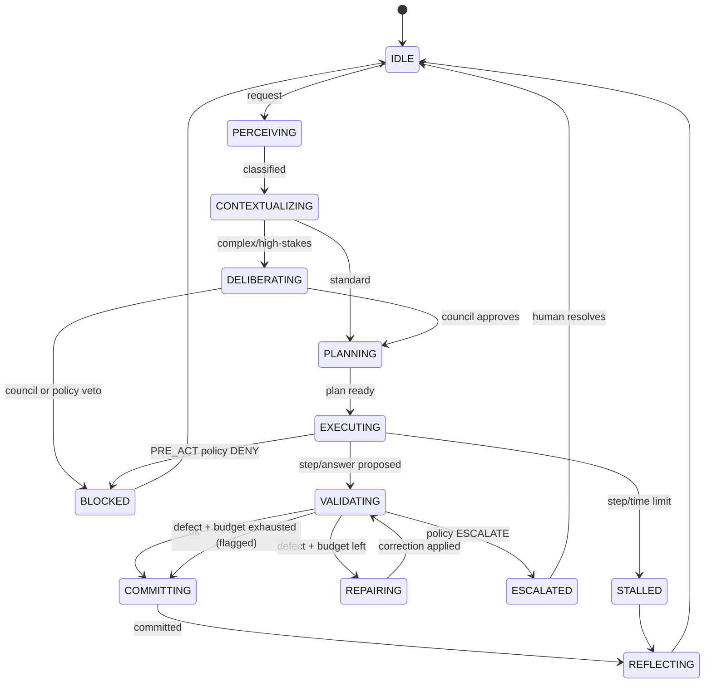
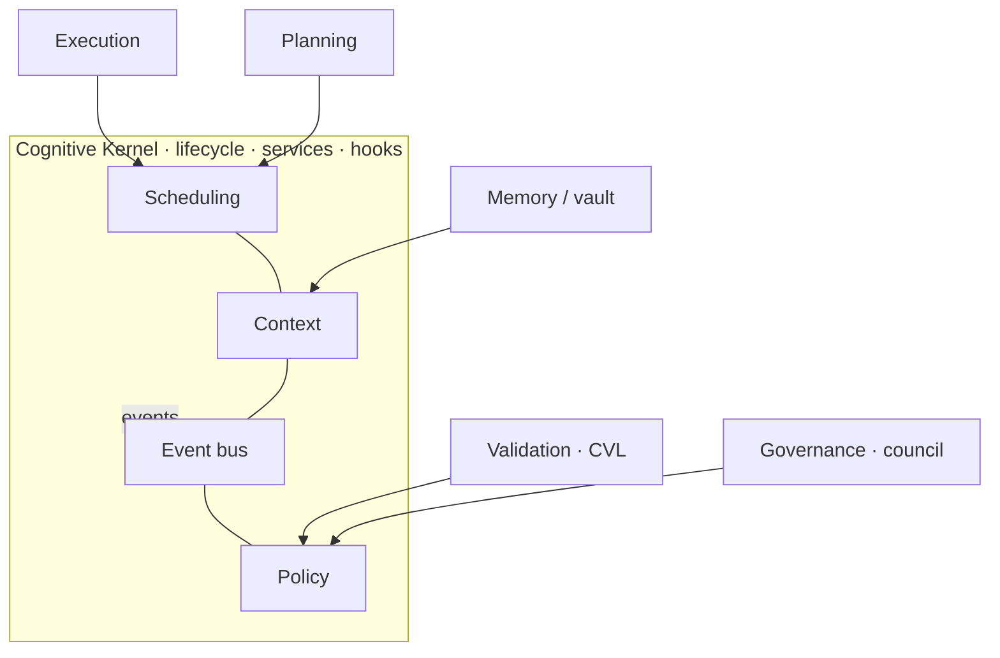

# SkynetClaw Cognitive Kernel — Specification

**Version:** 0.2 (ratification decisions + Council amendments folded in)
**Date:** 2026-07-13 · **Owner:** ElmatadorZ (Operator/Architect)
**Status:** Design only. No kernel code is written under this version. Validator
development is **paused** until the foundational migration lands (ADR-0003).
Reviewed by the Engineering Council — see
[COGNITIVE_KERNEL_REVIEW.md](COGNITIVE_KERNEL_REVIEW.md) (Accept with amendments A1–A6).
**Governs:** SkynetClaw Engineering Constitution v1.0. Related: ADR-0001 (RVL),
ADR-0002 (CVL), ADR-0003 (adopt Kernel + pause validators).

---

## 0. Purpose & analogy

SkynetClaw's cognitive machinery grew as capable-but-scattered modules — routing,
memory (the Obsidian second brain), a deliberation council, a planner, an execution
loop, an event bus, and now the Cognitive Validation Layer (CVL). CVL proved the
value of a *stable interface + registry* pattern. This specification promotes that
pattern to the level of the whole system: a **Cognitive Kernel (CK)** that defines
the lifecycle, services, events, policies, state machine, and interfaces every
cognitive subsystem conforms to.

The Linux analogy is deliberate and load-bearing:

| Linux | Cognitive Kernel |
|---|---|
| Process lifecycle & scheduler | **Cognitive Lifecycle** (§2) driving a request through phases |
| Syscalls / kernel services | **Kernel Services** (§3) subsystems request |
| Signals / netlink / uevents | **Event Model** (§4) — the audit spine |
| LSM / SELinux policy hooks | **Policy Model** (§5) — governance at hook points |
| Process states (R/S/D/Z) | **Cognitive State Machine** (§6) |
| Stable driver ABI | **Subsystem Interfaces** (§7) memory/planning/validation/execution/governance |
| Drivers | Validators (CVL), tools, model adapters |

**CVL is the first formal subsystem** — the Validation Subsystem. It is not the
kernel; it is a driver-host that plugs into a kernel hook.

---

## 1. Design principles (non-negotiable)

1. **Kernel = interfaces + a thin orchestrator, not a god-object.** The kernel owns
   the lifecycle, the hook points, and the service contracts. It does *not* absorb
   subsystem logic. This is the guardrail against a big-bang rewrite.
2. **Mechanism vs. policy separation.** The kernel provides *mechanism* (where and
   when a decision is made). *Policy* (what the decision is) is declarative and
   lives in the Policy Model (§5) — sourced from the Constitution.
3. **Everything a transition does emits an event.** The Event Model (§4) is the
   single audit spine. No silent state change. This generalizes CVL's Explain stage
   to the whole kernel.
4. **Dependency inversion.** Subsystems depend on kernel *interfaces* (§7), never on
   each other directly. Any subsystem is swappable behind its Protocol.
5. **Deterministic, fail-safe gates.** Validation/policy checks are deterministic
   and model-free where possible; a failing or throwing check degrades safely
   (skip-and-log, or block), never crashes the mission. (Carried from CVL.)
6. **Strangler-fig migration, never rewrite.** Existing modules are *adapted* to
   conform to kernel interfaces one at a time (§8). The system stays shippable
   throughout.
7. **Respect the physical envelope.** The kernel must honor hard constraints:
   the 16 384-token context ceiling (execution runtime is VRAM-bound) and
   CPU-bound execution latency. The Context Service (§3) owns the budget so no
   subsystem can overflow it.

---

## 2. Cognitive Lifecycle

The path of one **cognitive request** — a user message, a Telegram message, a
scheduled trigger, or an autonomous goal — through the kernel. This is the
"cognitive scheduler": the kernel advances a request through phases, each guarded
by policy and validation.



| Phase | What happens | Today's component(s) |
|---|---|---|
| **Perceive** | Input arrives; classify intent (chat / mission / deliberation) | `continental_relay`, `discovery` |
| **Contextualize** | Assemble budgeted working context; recall from the second brain | Memory Subsystem (vault), `_fit_context`, `house_state` |
| **Deliberate** | For complex/high-stakes tasks: multi-lens council review | `agent_council` (L5), Governance Subsystem |
| **Plan** | Decompose goal into ordered steps (+ dependency graph — *gap, P5*) | planner `_pcall` |
| **Execute** | Run tools / model calls; act-boundary guard on each side effect | `agent_run`, `_llm_stream`, `_resolve_path`, `guidance_check` (G1) |
| **Validate** | Cognitive quality gate before accepting a response or action | **CVL** (`cognitive_validation`), `completion_evidence`, `warrant_check` |
| **Repair** | Bounded correction loop when Validate finds a defect | `completion_rejections` budget → back to Validate |
| **Commit** | Emit the response / perform the side-effecting action; record prediction | response stream, Outcome Clock |
| **Reflect** | Persist episodic + semantic memory; update eval/SCB; emit events | vault, `eval_suite`, `house_sync` |

**Invariants**
- `Execute → Commit` is impossible without passing `Validate` (or Commit-with-flag
  after the Repair budget is exhausted).
- Every phase entry/exit emits a `lifecycle.*` event (§4).
- The Context Service guarantees the prompt entering Execute fits the ceiling.

---

## 3. Kernel Services

Services the kernel **provides** to subsystems (the "syscall surface"). Each has a
stable interface; subsystems consume services, never each other.

| Service | Responsibility | Backed today by |
|---|---|---|
| **Context** | Assemble working context within the token budget; own the 16k ceiling; never overflow | `_fit_context`, `_est_tokens` |
| **Memory** | Read/write episodic (sessions), semantic (vault notes), working (house_state) | Obsidian vault, `house_state` |
| **Scheduling** | Drive the lifecycle state machine; route CHAT vs mission vs council; own step & repair budgets | `continental_relay`, `discovery`, `agent_run` loop |
| **Event** | Publish/subscribe the cognitive event bus; the audit spine | `house_sync.publish` |
| **Validation** | Register validators; run the quality gate at a hook; return diagnose/repair/explain | **CVL** |
| **Policy** | Evaluate governance policies at a hook; return ALLOW/DENY/REPAIR/FLAG/ESCALATE + rationale | `guidance_check`, `warrant_check`, Constitution |
| **Execution** | Invoke tools (parallel-safe prefetch) and model calls; sandbox paths | `_llm_stream`, `_PARALLEL_SAFE`, `_resolve_path` |
| **Governance** | Deliberation/council, ADR gate, escalation to human | `agent_council`, ADR process |
| **Telemetry/Audit** | Explain records, outcome predictions, eval hooks | CVL Explain, Outcome Clock, `eval_suite` |

**Service contract rules (D1):** synchronous control where correctness depends on
ordering (Context, Validation, Policy, Execution); best-effort *observational*
events for the rest (Event, Telemetry). Every service call is traceable to a
`correlation_id` (§4).

**Service-failure degradation (A3):** a service that fails mid-lifecycle degrades to
a defined safe state — **block or flag, never silent-proceed**. Commit is
**idempotent**: a re-entered Commit must not double-fire a side effect. Boundary:
Scheduling *classifies and routes* (CHAT / mission / deliberation); Governance
*deliberates* only when routed to DELIBERATING and *authors policy* — classification
is never Governance's job (A1).

**Kernel performance budget (A5):** kernel orchestration (routing + hook evaluation
+ eventing) must cost **< 5%** of a request's wall-clock on the CPU-bound host.
Policies are gated by a cheap `applies()` predicate and indexed by hook so cost does
not grow with the policy count.

---

## 4. Event Model

The event bus is the kernel's nervous system and its audit trail. It already exists
as `house_sync`; the spec formalizes its schema and taxonomy.

**Event envelope**
```
Event = {
  type: str,             # dotted namespace, e.g. "cognitive.invalid"
  payload: dict,         # type-specific
  source: str,           # subsystem name, e.g. "cvl", "planner"
  correlation_id: str,   # the cognitive request / mission id (traces a lifecycle)
  ts: float,             # epoch seconds
  severity: str          # info | warn | error
}
```

**`correlation_id` (D2):** minted **per cognitive request**; a mission groups many
requests via a `mission_id` group key. This traces one chat turn or sub-step through
the whole lifecycle.

**Two tiers (A2 — resolves the audit-vs-best-effort tension under D1):**
- **Audit-critical** — `policy.*`, `mission.commit`, `*.escalated`, `cognitive.invalid`.
  Delivered **synchronously and durably logged**. These *are* the black-box recorder.
- **Observational** — `lifecycle.*`, `memory.*`, notes. Best-effort, may drop, never
  blocks a transition.

**Delivery semantics:** ordered *per `correlation_id`*; subscribers idempotent. A
dropped *observational* event never blocks a transition; an audit-critical event
that cannot be durably recorded blocks the transition it attests (fail-safe).

**Event authority (A4):** only the Policy service may emit `policy.*` verdicts; only
the Validation service (CVL) may emit `cognitive.*` verdicts. Consumers trust an
authority event only from its owning `source`; a spoofed verdict from another source
is ignored.

**Namespaces (taxonomy)**

| Namespace | Emitted at | Examples |
|---|---|---|
| `lifecycle.*` | every phase transition (§2) | `lifecycle.plan`, `lifecycle.execute`, `lifecycle.commit` |
| `cognitive.*` | Validation subsystem | `cognitive.invalid`, `cognitive.unverified`, `cognitive.note` |
| `policy.*` | Policy subsystem decisions | `policy.denied`, `policy.escalated`, `policy.flagged` |
| `memory.*` | recall/persist | `memory.recalled`, `memory.persisted` |
| `mission.*` | mission lifecycle | `mission.opened`, `mission.completed`, `mission.incomplete` |
| `outcome.*` | Outcome Clock | `outcome.predicted`, `outcome.judged` |

**Rule:** any state transition or automatic repair MUST emit an event carrying a
human-readable rationale (generalizes CVL's Explain). The event log is the
system's black-box recorder.

---

## 5. Policy Model

Governance made declarative and enforced at kernel hook points — the analog of LSM
security hooks. The Engineering Constitution is the primary policy source.

**Policy**
```
Policy = {
  id: str,                 # e.g. "ART-V-blast-radius", "SAFE-no-secret-leak"
  hook: HookPoint,         # where it is evaluated
  applies(ctx) -> bool,    # cheap predicate
  evaluate(ctx) -> Decision
}
Decision ∈ { ALLOW, DENY, REPAIR, FLAG, ESCALATE }  # + rationale (audited)
```

**Hook points** (the kernel's fixed enforcement surface):

| Hook | Fires before | Typical policies |
|---|---|---|
| `PRE_PLAN` | planning a goal | feature-freeze (Epic Trust), scope/blast-radius sizing |
| `PRE_ACT` | a side-effecting tool call | guidance G1 (deviant-act guard), path-sandbox, prohibited actions |
| `PRE_VALIDATE` | running the quality gate | select which validators apply |
| `PRE_COMMIT` | accepting a response/action | CVL result, completion evidence, warrant (no fabrication) |
| `PRE_RESPONSE` | surfacing to the human | secret-leak (safety), tone/consistency |

**Resolution:** all applicable policies at a hook are evaluated; **most-restrictive
wins** (`DENY > ESCALATE > REPAIR > FLAG > ALLOW`). Every decision emits an
audit-critical `policy.*` event with its rationale (§4). `REPAIR` routes the
lifecycle to the Repair phase (bounded); `ESCALATE` transitions to the
human-in-the-loop state (with the A3 abort-on-timeout default).

**Authoring (D3):** phase 1 uses hand-written, typed `Policy` objects registered on
hooks (fast, testable, mirrors the CVL `Validator` pattern). A council-editable
declarative policy format is deferred to a later phase, once the hook surface is
proven in code.

**Mechanism vs policy:** the kernel guarantees the hook *fires* (mechanism);
*which* policies exist and what they decide is data, editable without touching the
kernel — new governance = register a policy, exactly as new checks = register a
validator.

---

## 6. Cognitive State Machine

A cognitive request is a state machine the Scheduling service advances. States
generalize the mission lifecycle (`house_state`, `mission_command` buckets).



**Transition table (guarded)**

| From | Event | Guard (policy/validation) | To |
|---|---|---|---|
| CONTEXTUALIZING | classified | `looks_like_deliberation` | DELIBERATING |
| EXECUTING | proposes side effect | `PRE_ACT` ALLOW | (stays) EXECUTING |
| EXECUTING | proposes side effect | `PRE_ACT` DENY | BLOCKED |
| VALIDATING | gate run | CVL `ok` | COMMITTING |
| VALIDATING | gate run | CVL defect ∧ `rejects ≤ MAX` | REPAIRING |
| VALIDATING | gate run | CVL defect ∧ `rejects > MAX` | COMMITTING (flag) |
| any | policy ESCALATE | — | ESCALATED |

**Mapping to today:** `COMMITTING(flag)` = current "accept-with-flag" branch;
`REPAIRING↔VALIDATING` = the `completion_rejections` loop; `STALLED` = the `LIMIT`
final status; `mission_command` fail/incomplete/complete map to
BLOCKED/STALLED/REFLECTING outcomes.

**ESCALATED safety (A3):** `ESCALATED` carries a timeout. If the human does not
resolve within it, the request defaults to **abort (safe)** — never auto-proceed. An
"escalate-then-proceed" path is prohibited by construction.

---

## 7. Subsystem Interfaces (the kernel ABI)

Stable contracts every subsystem implements — expressed as Python Protocols (the
same pattern CVL's `Validator` already uses). **These are signatures to ratify, not
code to ship in v0.1.**

```python
class MemorySubsystem(Protocol):
    def recall(self, query: str, ctx: Context) -> list[Recollection]: ...
    def persist(self, record: MemoryRecord) -> None: ...
    # store = the Obsidian second brain (episodic sessions + semantic notes)

class PlanningSubsystem(Protocol):
    def plan(self, goal: str, ctx: Context) -> Plan: ...   # Plan carries a DAG of Steps
    def replan(self, plan: Plan, feedback: Feedback) -> Plan: ...

class ValidationSubsystem(Protocol):        # ← CVL implements this today
    def register(self, validator: Validator) -> None: ...
    def validate(self, candidate: str, hook: HookPoint, ctx: Context) -> ValidationReport: ...

class ExecutionSubsystem(Protocol):
    def execute(self, action: Action, ctx: Context) -> ActionResult: ...
    def resolve(self, path: str, ctx: Context) -> SafePath: ...   # sandbox + vault exemption

class GovernanceSubsystem(Protocol):
    def deliberate(self, proposal: Proposal, ctx: Context) -> Verdict: ...
    def evaluate_policies(self, hook: HookPoint, ctx: Context) -> Decision: ...
    def escalate(self, reason: str, ctx: Context) -> None: ...
```

**Interaction contract**



- **Memory** feeds Context; consumed by Planning & Validation; emits `memory.*`.
- **Planning** consumes Memory+Context; produces a Plan (DAG); governed at
  `PRE_PLAN`; emits `lifecycle.plan`.
- **Validation (CVL)** runs at `PRE_VALIDATE`/`PRE_COMMIT`/`PRE_RESPONSE`; emits
  `cognitive.*`. Already conforms — the reference subsystem.
- **Execution** guarded at `PRE_ACT`; sandboxes via `resolve`; emits
  `lifecycle.execute`.
- **Governance** authors policies, runs deliberation, can veto a transition or
  escalate; emits `policy.*`.

---

## 8. Migration map (strangler-fig, Constitution Article V)

The kernel is realized by **adapting** existing modules to the interfaces above —
one subsystem per PR, system shippable throughout. No rewrite.

| Current module | Becomes | Conformance work |
|---|---|---|
| `cognitive_validation.py` | Validation Subsystem | **already conforms** (reference) |
| `house_sync` | Event Service | formalize envelope + namespaces (§4) |
| `_fit_context` / `_est_tokens` | Context Service | wrap behind `Context` interface |
| Obsidian vault + `house_state` | Memory Subsystem | define `recall`/`persist` over the vault |
| `agent_council` | Governance Subsystem | expose `deliberate`/`evaluate_policies` |
| `guidance_check`, `warrant_check` | Policy Subsystem | express as `Policy` objects on hooks |
| planner `_pcall` | Planning Subsystem | add the dependency DAG (closes P5) |
| `agent_run` loop, `_llm_stream`, `_resolve_path` | Execution + Scheduling | split scheduling from execution |
| `mission_command`, `continental_relay`, `discovery` | Scheduling Service | map buckets → state machine (§6) |
| Outcome Clock, `eval_suite` | Telemetry/Audit | subscribe to the event spine |

**Sequencing:** (1) ratify this spec ✅ → (2) formalize Event envelope (with the A2
two-tier split) ✅ **DONE — `backend/kernel_events.py`** (envelope + tiers + A4
authority + D2 correlation + durable audit; conforms_to() green; first emitter
migrated: the CVL gate → `cognitive.invalid`) → (3) define Context + Memory
interfaces ✅ **DONE — `kernel_context.py` owns the 16k budget (main delegates) +
`kernel_memory.py` recall/persist over the vault; both `conforms_to()` green** →
(4) express existing checks as typed Policies on the hook surface ✅ **DONE —
`kernel_policy.py`: Policy ABI + engine (most-restrictive wins, emits audited
`policy.*`); guidance_check→PRE_ACT, warrant_check→PRE_COMMIT; `conforms_to()`
green** → (5) split Scheduling from Execution (wire the hooks to fire live) ✅
**DONE — `kernel_execution.py`: the act boundary IS the PRE_ACT hook (GPS-2 ·
shadow · prior-approvals · run allow-list are all Policies, resolved
most-restrictive, FAIL-CLOSED) and the answer boundary IS PRE_COMMIT (warrant ·
guidance). Proven never more permissive than the legacy chain; A3 idempotent
commit + escalation-aborts-on-timeout; A5 overhead 3.9 ms/act (0.08%)** →
(6) *then* resume validator development, now as drivers on a real kernel.

> **Correction to §5 (honest):** the table places guidance G1 at `PRE_ACT`, but the
> real check is **post-hoc** — it reads the ordered act+observation log and can only
> be judged once the acts exist. G1 is therefore a **PRE_COMMIT** policy today. A
> true per-act guidance gate needs a different, *prospective* check — recorded as
> future work, not silently claimed.

**Definition of done per step (A6):** a subsystem is "migrated" only when it ships a
`conforms_to(<interface>)` case in `eval_suite` that is green. A half-migrated module
without a green conformance case does not count as done — this distinguishes finished
from in-flight during the strangler-fig transition.

---

## 9. Non-goals for v0.1

- No kernel implementation, no module moves, no interface code merged.
- No new validators (explicitly paused until ratification).
- No change to runtime behavior — this document is inert until ADR-0003 is accepted
  and a migration PR is opened.

## 10. Ratification decisions (resolved 2026-07-13)

1. **Async model → RESOLVED (D1):** synchronous control + best-effort *observational*
   events; audit-critical events are synchronous+durable (A2). Full async deferred.
2. **Correlation id → RESOLVED (D2):** per-request cognitive id, grouped by
   `mission_id`.
3. **Policy authoring → RESOLVED (D3):** typed `Policy` objects now; declarative
   format later.
4. **Planning DAG → OPEN (follow-up):** the dependency graph (closes P5) is scoped to
   the Planning-subsystem migration PR, not v0.x of the spec.
5. **Escalation UX → PARTIALLY RESOLVED (A3):** default is abort-on-timeout; the
   human-facing surface for `ESCALATED` is a migration-time detail.

## 11. Verification of the spec (how we know it's right)

Before any migration PR, this spec is validated by: (a) Engineering Council review
across all lenses (Article IX); (b) a **traceability check** — every abstraction in
§2–§7 names a real component in §8 (done); (c) a walkthrough of 2–3 real past
missions against the state machine (§6) to confirm no phase is missing.

---

*This is a living document. Changes require an ADR reference and a version bump.*
