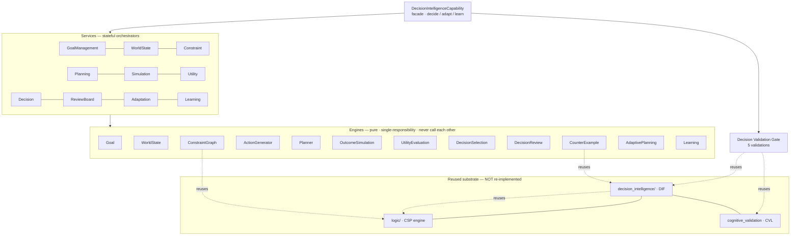
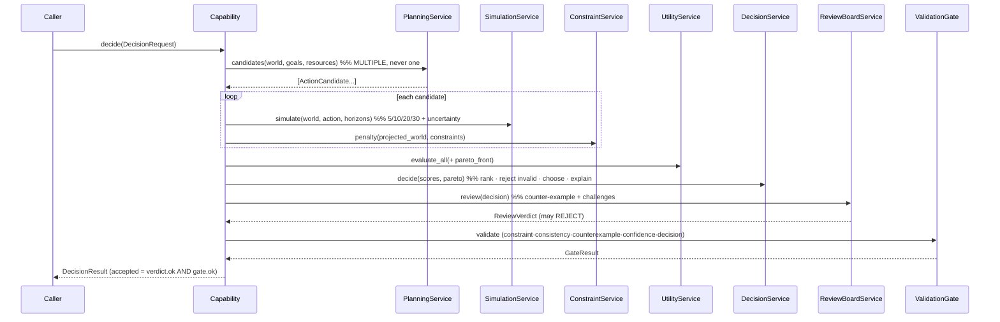

# Decision Intelligence Capability — Architecture

> Companion to [ADR-0012](../adr/ADR-0012-decision-intelligence-capability.md).
> A first-class capability that sits **above** reasoning and turns it into verifiable,
> adaptive, resource-aware decision-making. Reuses `logic/` (ADR-0008),
> `decision_intelligence/` DIF (ADR-0011), and CVL (ADR-0002) — no duplication.

## Layered architecture (Capability → Service → Engine → Tool → Validator)



ASCII fallback:

```
Capability (facade)                DecisionIntelligenceCapability.decide/adapt/learn
  └─ Services (10, stateful)       Goal · WorldState · Constraint · Planning · Simulation
       │                           Utility · Decision · ReviewBoard · Adaptation · Learning
       └─ Engines (12, pure)       Goal · WorldState · ConstraintGraph · ActionGenerator ·
            │  (no engine→engine)   Planner · OutcomeSimulation · UtilityEvaluation ·
            │                       DecisionSelection · DecisionReview · CounterExample ·
            │                       AdaptivePlanning · Learning
            └─ Validator            Decision Validation Gate  → integrates CVL + DIF
  reuses ▶ logic/ (ADR-0008) · decision_intelligence/ DIF (ADR-0011) · CVL (ADR-0002)
```

**Rules (enforced structurally):** engines import only `contracts`, `interfaces`, and the
reused substrate — never another engine. Services own engine instances and pass data
between them; services may call services (e.g. Adaptation → Planning). Everything
pluggable (planner/utility/simulator/policy) resolves through `registry.py`.

## Decision sequence



## Adaptive re-planning (minimal patch)

```
world change ─▶ AdaptationService ─▶ AdaptivePlanningEngine.patch
   diff(old,new) → for each plan step: does it touch a changed var?
     yes → regenerate ONLY that step (via PlanningService)   → changed_steps
     no  → keep as-is                                        → kept_steps
   result: PlanPatch (never a full re-plan)
```

## Determinism & LLM-independence

No LLM, no `eval`, no RNG or wall-clock in the decision path. A `DecisionRequest` + a fixed
set of registered plugins ⇒ byte-identical `DecisionResult` (deterministic replay). The
simulator's uncertainty is a closed-form function of horizon × (1 − confidence), not
sampling. Verified by `test_dic_integration` / `test_dic_stress` / `test_dic_simulation`.

## Tests

| File | Type |
|---|---|
| `backend/tests/test_dic_unit.py` | unit (per engine) |
| `backend/tests/test_dic_integration.py` | integration + acceptance criteria |
| `backend/tests/test_dic_scenario.py` | scenario (end-to-end) |
| `backend/tests/test_dic_simulation.py` | simulation properties |
| `backend/tests/test_dic_stress.py` | stress + benchmark |

Reused-subsystem suites (`test_logic`, `test_di_*`, `test_decision`) stay green —
backward compatibility.
