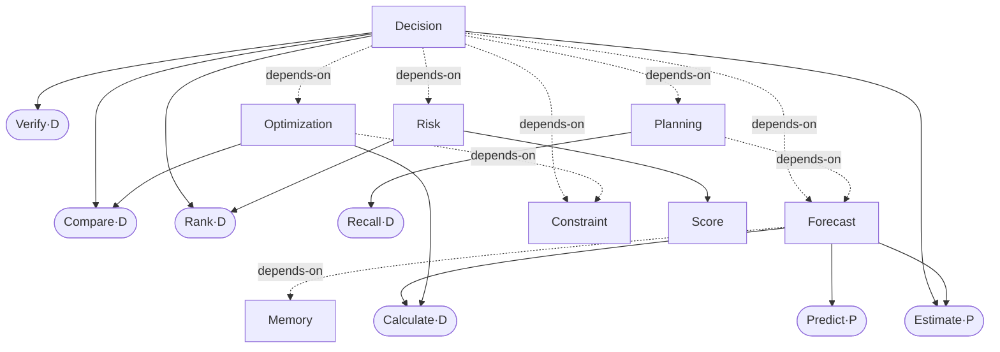

# Capability Dependency Graph (CDG)

**Version:** 0.1 (DRAFT — design only) · **Date:** 2026-07-13 · **Owner:** ElmatadorZ
**Under:** ADR-0007 · **Replaces:** the "capability tree" framing of CAPABILITY_MODEL.
**Depends on:** COGNITIVE_PRIMITIVES.md (the leaf nodes). **Feeds:** MATURITY_MODEL.md.

The real structure of cognition is a **graph, not a tree**: one capability is a
dependency of many, and composes from many. Decision depends on Forecast, Risk,
Constraint, Optimization, Planning; Forecast depends on Statistics, Trend, Probability,
Memory. A tree cannot express this; the CDG does.

---

## 1. Node & edge model

**Nodes:** Primitives (leaves, from COGNITIVE_PRIMITIVES) and Capabilities.

**Edges (two kinds):**
- `composes-from` — a Capability is built from Primitives (and sub-Capabilities). This
  is *definitional* — remove them and the capability is undefined.
- `depends-on` — a Capability requires another Capability at runtime (weaker than
  composition; a collaboration, not a part).

**Acyclicity rule:** `composes-from` must form a **DAG** — a capability cannot be part
of its own definition (transitively). `depends-on` *runtime* edges may be recursive
(Planning may invoke Forecast which invokes Memory which… ) but the *definition* graph
is acyclic. This distinction keeps the model well-founded while allowing rich runtime
collaboration.

---

## 2. Example subgraph



Read: **Decision composes from** Compare/Estimate/Rank/Verify **and depends on**
Risk/Forecast/Constraint/Optimization/Planning. Forecast is shared by Decision and
Planning — a graph edge no tree could hold.

---

## 3. What the graph is FOR (not decoration)

1. **Determinism/trust propagation (from COGNITIVE_PRIMITIVES §3).** A capability's
   trust class = the least-deterministic node it composes from / depends on. Decision
   inherits `P`/`M` if any dependency is probabilistic — computed from the graph, not
   asserted.
2. **Maturity bound (feeds MATURITY_MODEL).** A capability's *effective* maturity is
   **capped by its weakest dependency**: you cannot have a `Trusted` Decision while its
   `Forecast` dependency is `Emerging`. The graph makes this computable.
3. **Impact analysis.** Degrade or change a node → traverse dependents → know exactly
   which capabilities are affected (regression blast radius, before you touch code).
4. **Build ordering.** Topologically sort the DAG → the correct implementation order is
   *derived*, not guessed (primitives → leaf capabilities → composite capabilities).
5. **Gap discovery.** A capability whose `composes-from` references a non-existent
   primitive reveals a missing instruction (COGNITIVE_PRIMITIVES §5.1).

---

## 4. The CDG registry (schema — data, not code)

```
CDGNode : { id, kind: primitive|capability, determinism: D|P|M, family }
CDGEdge : { from, to, kind: composes-from|depends-on }

# derived (computed, never hand-set):
trust_class(node)      = least-deterministic over composes-from ∪ depends-on
maturity_ceiling(cap)  = min( effective_maturity(dep) for dep in deps )
build_order()          = topological_sort(composes-from DAG)
impact_of(node)        = transitive dependents(node)
```

The registry is the single source of truth for §3's computations; CAPABILITY_MODEL.md
is a *projection/view* of it (per-family tables), not a second source.

---

## 5. Invariants

1. `composes-from` is acyclic (well-founded definitions).
2. Every capability's `composes-from` resolves to existing primitives/sub-capabilities
   (no dangling composition — checked like a Planning DAG).
3. Trust class and maturity ceiling are **derived from the graph**, never assigned.
4. The CDG is versioned; an edge change is an architectural event (it can move a
   capability's ceiling).
